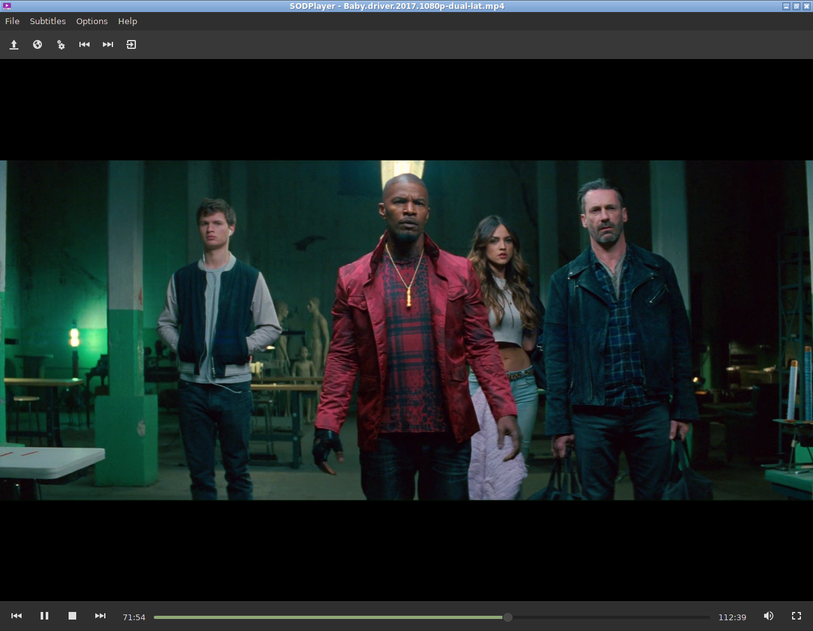

¡Lee la versión en español [aquí](README_es.md)!			
		 
# SODPlayer 

A lua-based video playing software made with GTK and GStreamer

## Screenshot

 

## Instalation

```
git clone https://github.com/sodomon2/SODPlayer.git
cd SODPlayer/
[sudo] make install
```

## Dependencies 

- [Gstreamer](https://gstreamer.freedesktop.org/download/)
- [Lua-LGI](https://github.com/pavouk/lgi)
- [Lua5.1](https://www.lua.org/download.html) 
- [LuaJIT](https://luajit.org/download.html) (Optional replacement for Lua5.1)

### Execute

`lua5.1 init.lua` (or `luajit init.lua`)
