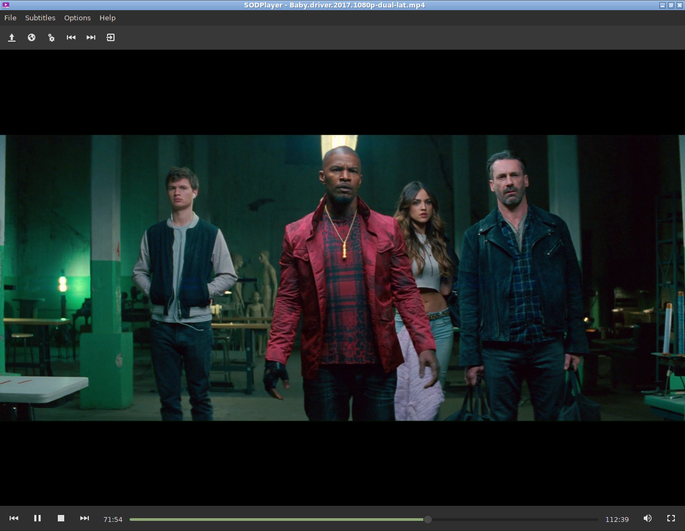

¡Lee la versión en español [aquí](README_es.md)!			

# SODPlayer
A lua-based video playing software made with GTK and GStreamer

## Screenshot

 

## Installation

```
git clone https://github.com/sodomon2/SODPlayer.git
meson build && cd build
[sudo] ninja install
```

## Dependencies 

- [Gstreamer](https://gstreamer.freedesktop.org/download/)
- [Lua-LGI](https://github.com/pavouk/lgi)
- [Lua5.1+](https://www.lua.org/download.html) (or [LuaJIT 2.0+](https://luajit.org/))
- [Lua-BitOp](http://bitop.luajit.org/download.html) (For Gettext)

### Execute

`lua5.1 init.lua` (or `luajit init.lua`)
