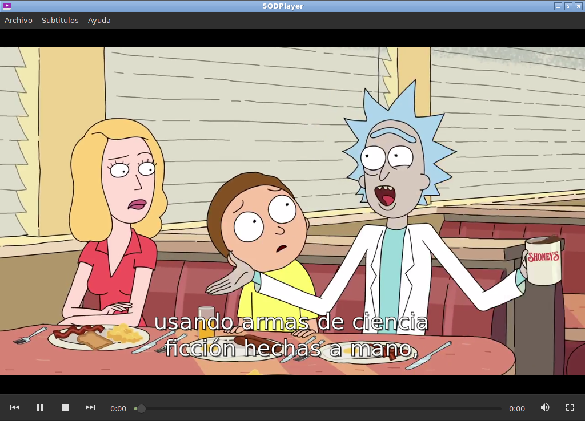

# SODPlayer

un reproductor hecho en lua Gtk y Gstreamer

## Screenshot

 

### Dependencias 

- [Gstreamer](https://gstreamer.freedesktop.org/download/)
- [Lua-LGI](https://github.com/pavouk/lgi)
- [Lua5.1](https://www.lua.org/download.html)

#### Execute

lua5.1 `init.lua`
