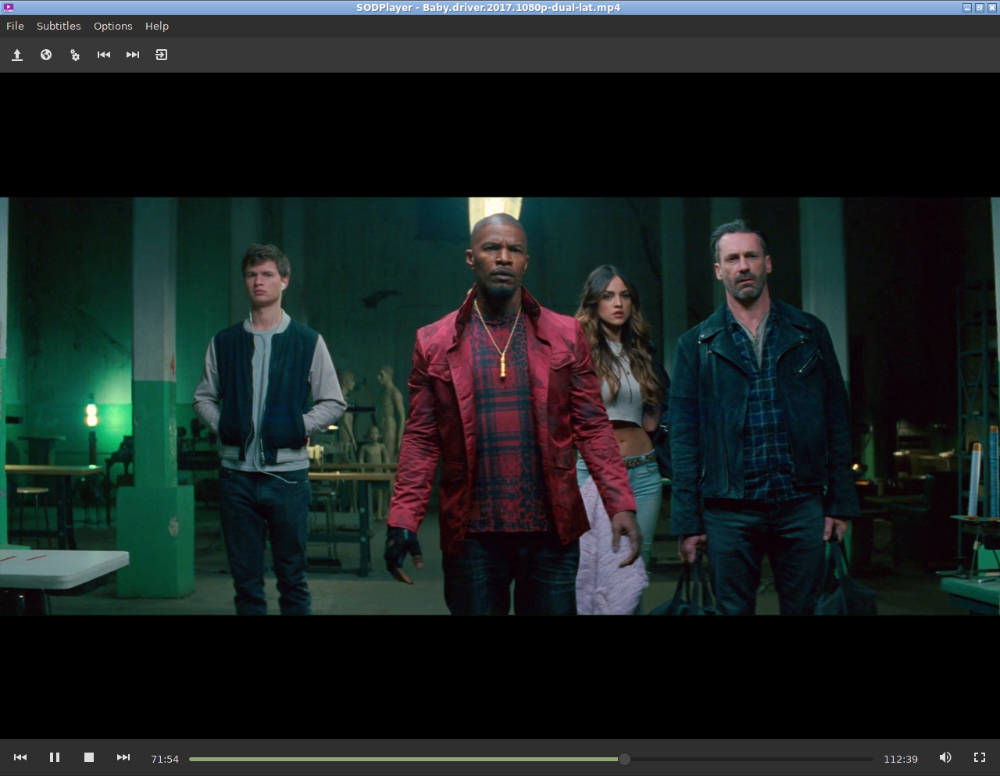

# SODPlayer

Un software de reproducción de video basado en lua hecho con GTK y GStreamer

## Screenshot

 

## Instalacion

```
git clone https://github.com/sodomon2/SODPlayer.git
cd SODPlayer/
[sudo] make install
```

## Dependencias 

- [Gstreamer](https://gstreamer.freedesktop.org/download/)
- [Lua-LGI](https://github.com/pavouk/lgi)
- [Lua5.1](https://www.lua.org/download.html)
- [LuaJIT](https://luajit.org/download.html) (reemplazo opcional a Lua5.1)
- [Lua-BitOp](http://bitop.luajit.org/download.html) (Para el soporte a Gettext)

### Execute

lua5.1 `init.lua` (o luajit `init.lua`)
